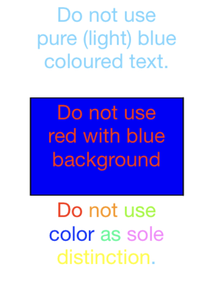
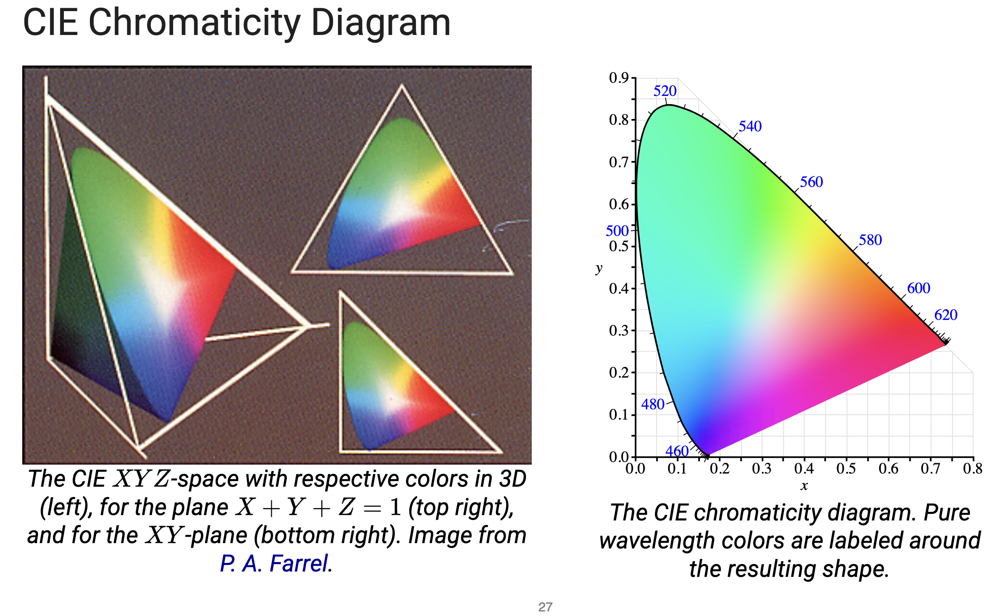
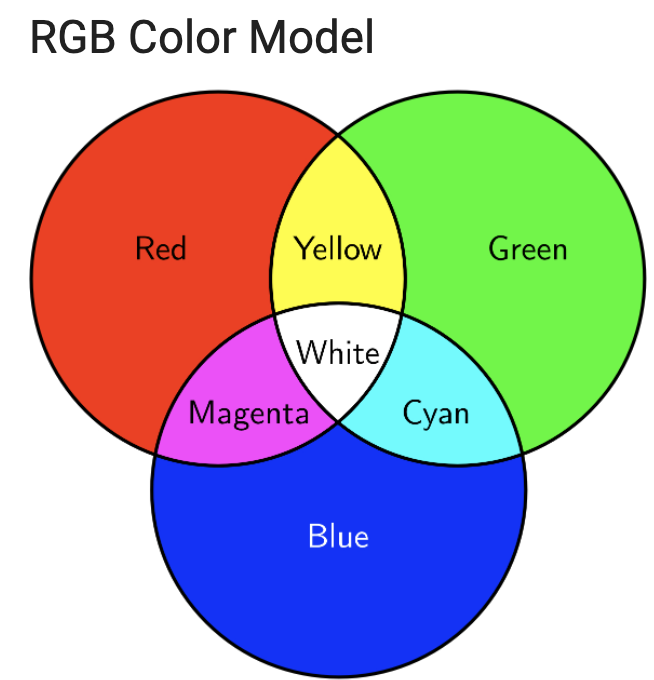
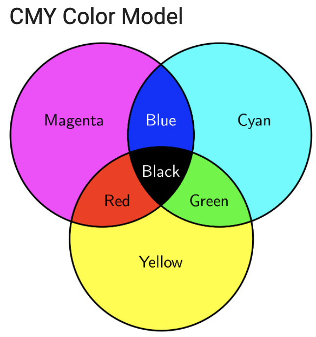
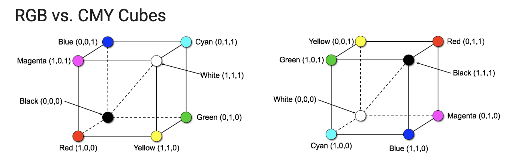
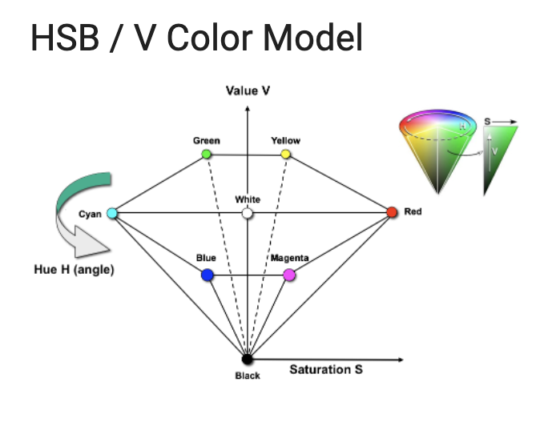

# Vorlesung 2

## Visible light

###  Visible spectrum

Frequenzbereich
380nm - 760nm

The electro magnetic spectrum and the human-visible spectrum of light

### Fields of Study
Radiometry -> Photometry -> Colorimetry

### Humand Sense of Vision

#### Signal Path of Light:
1. Reflected/emitted from the environment
2. passes through corenea & vitreous humour
3. hits photosensitive cells on the retina
4. transformed into neuro electrical signals

#### Human Light Perception
- wavelength ~ 380nm (violet) -> ~ 780nm (red)
- Amplitude -> brightness
- Frequency -> color
  
#### optical Properties
- static contrast ratio ~ 100:1
- luminance range 
- fovea (highest acuity)
- Field of View: 30 Grad superior, 70 grad inferior, 45 grad nasal, 100grad temporal, binocular 130-135grad vertical 200-220 grad horizontal

#### Retina
##### Signal Path
1. rods and cones 
2. bipolar and horizonal cells
3. amacrine and ganglion cells
4. optical nerve fibres

##### Rods

- number: ~ 120 mil
- location: predominatly at the rim of the retina
- very photosensitive 
- important for mesopic vision (to see even dim light)

##### cones
- number: ~6mil
- location: predominantly in the center of the retina
- less photosensitive
- important for photopic vision (color perction)

Kinds:
- red-sensitive
  - num: 64% ~3,84mio
- green-sensitive
  - num: 32% ~1,92mio
- blue-sensitive
  - num: 4% ~ 0,24mio

#### Design Guidelines
1. Do not use pure blue colored text, fine lines or small shapes. (there are no blue-sensitive cones in retina’s central area)
2. Do not use red or green on edges of large pictures or ads.
3. Do not use red with blue background.
4. Do not use color as sole distinction

**Note**
- Color perception depends on ambient light.
- Elderly people require higher light intensity.

## Color Models

Goal : 
- map colors to unique values
  
Issue
- color models characterize only a subset of perceptible colors, not all

basic idea
- three primary colors are used analog to three kinds of cones
- colors are created by combining these primary colors

-> trstimulus Theory

### Biology-oriented
- CIE YXZ

Recall:

Tri-stimulus therory: 
- The humans visual system has receptors for red green and blue light

Approach

- Measure human color sensitivitz by experiments with standard conditions propsed by the "Commision Internationale de l'Eclairage" (CIE)
- Participants had to reprooduce pure spectral colors of wavelength  by mixing red (R=700nm), green (G=546nm) and blue (B=436nm) lights

Gamut 
- the subset of colors produced by (linearly) combining red, green and blue leads to a triangle in the CIE chromaticity diagram

White Point
- Dependent on type of illumination
- e.g. norm illumination D65

Technical Systems...
- ...can only generate spectra within the range (triangle) of the underlying principles of channels
- ... can only generate a certain luminance

### Hardware-oriented

#### RGB

Primary Colors
- R(ed), G(reen), B(lue)
- sum up to the "color" white

Additive color mixing
- light originates from headlights
- it solely gets brighter

- Colors representable as vectors with 3 elements [r,g,b]
- used on devices that emit light (e.g. displays)

  
#### CMY, CMYK

##### Primary Colors 
- cyan
- magenta 
- yellow
- sum up to the 'color' black

##### subtractive color mixing
- painter applies layers of colors
- it solely gets darker

- also representable as vectors with 3 elements [c,m,y]
- used on devices that apply paint(e.g. painters)

##### RGB vs CMY

Conversion:

- CMY are complementary to RGB
  (R,G,B ) = (1, 1, 1) - (C, M, Y)
- CMY was extended to CMYK (k=black) to get darker black and to save ink by having a separate cartridge for black

K= min {C, M, Y}
C = (1-R) - K
M = (1-G) - K
Y = (1-B) - K
### User-oriented 
#### HSB/HSV

- more intuitive color specifiation by hue saturation and brightness (value)
- also called HSV model. Simular to HSL models

## Light Intensities and Gamma Correction

### Observation
- Sensitivity is intensity-dependent
- High in dark areas
- Lower in bright areas

Consequences
- Too many bits to encode higher brightness range humans cannot differentiate.
- Too few bits to encode lower shadow values that humans are sensitive to.
- Requires more bits to maintain same visual quality.

