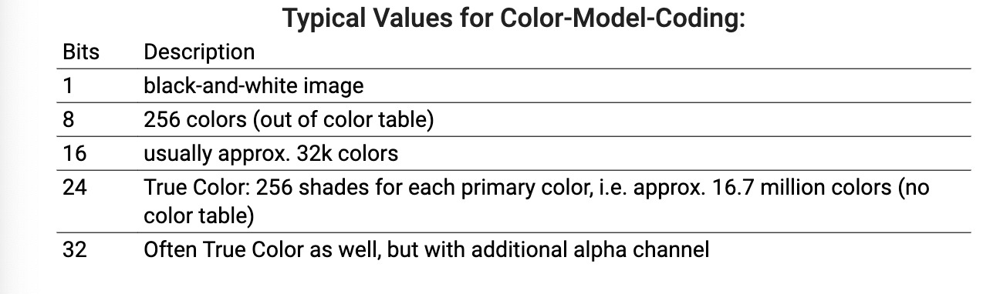

# Vorlesung 3

Image Representation Formats
## Raster graphics
Raster graphics are images that are stored in a rectangular grid of pixels.

A Matrix data structure represents a rectangular grid of pixels of color.
- Pixel 
  - Picture element, value depands on color model quantization, etc
- Resolution
  - Pixel in h/v direction
- Dots per inch (DPI)
  - reolution in h/v direction

### Digitization
Conversion process of information indo digial format, in which the informatiois organized into bits

1. Discretiztation 
   - Reading (sampling) of an analog signal at regualar intervals(frequency)
   - Each reading(sample) may be considered to have infinite precision at the stage
2. Quantization
   - Approximatio/rounding samples to a fixed set of numbers (such as integers)

#### Pixel Value Quantization
Two possible codings
 1. each single pixel contains a value compliant with particular color model
 2. each sindgle pixel contains a pointer into a color table

## Vector graphics
Vector graphics are images that are stored in a continuous stream of lines and curves.

Resolution independent image description by geometrical primites e.g. points, lines cicles, ellipses, etc.

### observations
- 2D raster displays are now common
- primitives have to be into series of pixels
- requires raster graphics conversion

